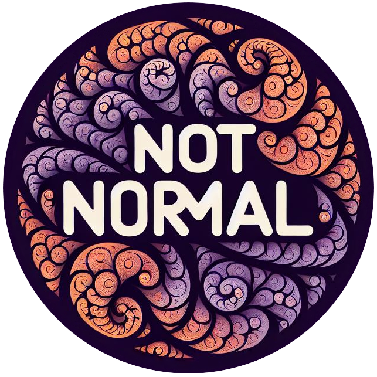

 

This package revolves around the **NotNormal** algorithm, which combines estimation and iteration to automatically extract events from (nano)electrochemical time series data.  The [*notnormal*](notnormal/docs/index.html) package includes the [*extract*](notnormal/docs/notnormal/extract.html), *gui*, [*filter*](notnormal/docs/notnormal/filter.html), [*simulate*](notnormal/docs/notnormal/simulate.html), [*reconstruct*](notnormal/docs/notnormal/reconstruct.html), [*utils*](notnormal/docs/notnormal/utils.html), and [*models*](notnormal/docs/notnormal/models.html) packages:

-  [*extract*](notnormal/docs/notnormal/extract.html): functional form of the NotNormal algorithm, to be used within preexisting code or without the use of the GUI. 

- *gui*: graphical interface for the algorithm along with additional functionality to aid in the extraction process. 

- [*filter*](notnormal/docs/notnormal/filter.html): predictive wavelet filter built on the estimate extraction, exploiting known event locations to maximise SNR.

- [*simulate*](notnormal/docs/notnormal/simulate.html): simulates traces from parameters describing noise, baseline, and event profiles.

- [*reconstruct*](notnormal/docs/notnormal/reconstruct.html): methods to reconstruct noise and events with further shape-based clustering and augmentation functionality.

- [*utils*](notnormal/docs/notnormal/utils.html): general utility functions for the project.

- [*models*](notnormal/docs/notnormal/models.html): dataclasses for internal use and structured results.

## GUI Quickstart

1. Launch the **GUI** → `python -m notnormal`
2. Click **Browse** → upon loading, the Z-score will be calculated automatically based on the sample size 
3. Click **Estimate** → this will estimate the cutoff frequency and event direction for iteration 
4. Click **Iterate** → this will produce the final results 
5. Click **Save** → this will produce a CSV file containing the event information

## FAQ

> **Q.** What is a Bounds Filter?  
> **A.** This will help determine bounding for asymptotic tailed events, it is only worth changing if inadequate bounding is identified on conclusion of estimation/iteration.

> **Q.** My estimate is attenuating events too much  
> **A.** Reduce the Estimate Cutoff. 

> **Q.** My estimate is bounding my events badly  
> **A.** Increase the Estimate Cutoff.

> **Q.** I want to use a different Threshold Window size  
> **A.** Nice! But be informed, an experiment was conducted to determine this was the ideal size for the estimate.

> **Q.** I want to use a lower Z-score  
> **A.** This will produce false positives presuming a perfectly normal sample after transformation. It is a good job the estimated number of false positives can be found in the results window upon completion of iteration. What you do with this information remains to be seen.

> **Q.** REPLACE FACTOR!? REPLACE GAP!?  
> **A.** 8 and 2 were determined to be the most consistent options for baseline determination and adequate attenuation of events during replacement. Feel free to experiment, or leave them. 

> **Q.** Do we not require a lower Z-score for the estimate because of the event influence?  
> **A.** No, the improved estimate is so accurate in the presence of outliers, it blew my socks off. So, we only need one Z-score for both estimation and iteration.

> **Q.** What does the estimate accomplish?  
> **A.** The estimate will determine the cutoff frequency for iteration and the direction of the events. Note, the direction is the starting point for iteration and will not be the final result. The final result *always* extracts biphasically. If you do not want events from a specific side, they are conveniently labelled in the results CSV.
